# Rapid Product Validation and Engineering Delivery Workflow

## Objective

This workflow allows departments to validate ideas quickly through lightweight prototypes before committing significant engineering resources.

The guiding principle is:

> **Prototype first, validate early, engineer properly after approval.**

```mermaid
flowchart TD

    %% =====================================================
    %% PHASE 1: IDEA INTAKE
    %% =====================================================

    A[Department identifies an idea, problem, or opportunity]

    A --> B[Submit idea brief]

    B --> B1[
        Define:
        - Problem being solved
        - Target users
        - Expected business value
        - Desired outcome
        - Urgency and constraints
    ]

    B1 --> C{Is the problem clear and worth exploring?}

    C -->|No| C1[Return to requesting department for clarification]
    C1 --> B

    C -->|Yes| D[Assign prototype owner]

    %% =====================================================
    %% PHASE 2: RAPID PROTOTYPING
    %% =====================================================

    D --> E[Create rapid prototype using vibe coding]

    E --> E1[
        Prototype may include:
        - Clickable UI
        - Basic user flow
        - Mock data
        - Limited business logic
        - AI-generated frontend
        - Minimal backend or API simulation
    ]

    E1 --> F[Deploy prototype to Cloudflare Pages or Workers]

    F --> F1[
        Prototype environment:
        - Isolated from production
        - Uses synthetic or non-sensitive data
        - Clearly labeled as experimental
        - Has limited access where necessary
    ]

    %% =====================================================
    %% PHASE 3: REVIEW AND ITERATION
    %% =====================================================

    F1 --> G[Stakeholder review and demonstration]

    G --> G1[
        Review criteria:
        - Does it solve the intended problem?
        - Is the user flow understandable?
        - Is there measurable business value?
        - Are users likely to adopt it?
        - Are major risks visible?
        - Is further investment justified?
    ]

    G1 --> H[Collect structured feedback]

    H --> I{Prototype requires revision?}

    I -->|Yes| J[Prioritize feedback and update prototype]
    J --> E

    I -->|No| K{Approval decision}

    %% =====================================================
    %% PHASE 4: DECISION GATE
    %% =====================================================

    K -->|Rejected| K1[Archive prototype and document findings]

    K1 --> K2[
        Record:
        - Reason for rejection
        - User feedback
        - Lessons learned
        - Reusable assets
        - Conditions for reconsideration
    ]

    K -->|Needs more evidence| K3[Run additional validation]
    K3 --> K4[
        Possible validation:
        - User interviews
        - Usability testing
        - Cost-benefit analysis
        - Technical feasibility spike
        - Security or compliance review
    ]
    K4 --> G

    K -->|Approved| L[Create formal engineering initiative]

    %% =====================================================
    %% PHASE 5: ENGINEERING INTAKE
    %% =====================================================

    L --> M[Convert prototype into formal requirements]

    M --> M1[
        Define:
        - Functional requirements
        - Non-functional requirements
        - Success metrics
        - Acceptance criteria
        - Scope and exclusions
        - Dependencies
        - Delivery milestones
    ]

    M1 --> N[Product and engineering planning]

    N --> N1[
        Planning activities:
        - Architecture review
        - Technical design
        - Effort estimation
        - Resource allocation
        - Risk assessment
        - Security and privacy review
        - Release strategy
    ]

    N1 --> O{Ready for development?}

    O -->|No| N
    O -->|Yes| P[Create backlog, issues, and delivery plan]

    %% =====================================================
    %% PHASE 6: ENGINEERING IMPLEMENTATION
    %% =====================================================

    P --> Q[Frontend development]

    Q --> Q1[
        Frontend work:
        - Production-grade components
        - Design system compliance
        - Accessibility
        - Responsive behavior
        - Error and loading states
        - Unit and component tests
    ]

    Q1 --> R[Backend and API development]

    R --> R1[
        Backend work:
        - Domain and business logic
        - Database design
        - APIs and integrations
        - Authentication and authorization
        - Audit logging
        - Error handling
        - Automated tests
    ]

    R1 --> S[System integration]

    S --> S1[
        Integration activities:
        - Connect frontend and backend
        - Integrate external services
        - Validate contracts and schemas
        - Configure infrastructure
        - Configure observability
        - Test failure scenarios
    ]

    %% =====================================================
    %% PHASE 7: VALIDATION
    %% =====================================================

    S1 --> T[Quality assurance]

    T --> T1[
        Testing may include:
        - Unit testing
        - Integration testing
        - End-to-end testing
        - Regression testing
        - Security testing
        - Performance testing
        - Accessibility testing
    ]

    T1 --> U[User acceptance testing]

    U --> V{Acceptance criteria satisfied?}

    V -->|No| V1[Create defects or change requests]
    V1 --> Q

    V -->|Yes| W[Release readiness review]

    %% =====================================================
    %% PHASE 8: RELEASE
    %% =====================================================

    W --> W1[
        Release checklist:
        - Deployment plan approved
        - Rollback plan prepared
        - Database migrations reviewed
        - Monitoring configured
        - Documentation completed
        - Support teams informed
        - Stakeholders notified
    ]

    W1 --> X{Release approved?}

    X -->|No| W
    X -->|Yes| Y[Deploy to production]

    %% =====================================================
    %% PHASE 9: POST-RELEASE
    %% =====================================================

    Y --> Z[Monitor production]

    Z --> Z1[
        Monitor:
        - Errors and incidents
        - Performance
        - Availability
        - User adoption
        - Business metrics
        - Support requests
    ]

    Z1 --> AA{Release performing as expected?}

    AA -->|Critical issue| AB[Rollback or apply emergency fix]
    AB --> Z

    AA -->|Minor issues| AC[Add improvements to backlog]
    AC --> AD[Continuous improvement]

    AA -->|Yes| AD

    AD --> AE[Measure outcomes against success metrics]

    AE --> AF[
        Report results to:
        - Requesting department
        - Engineering
        - Product leadership
        - Board or executive stakeholders
    ]

    %% =====================================================
    %% STYLES
    %% =====================================================

    classDef intake fill:#e3f2fd,stroke:#1565c0,color:#000;
    classDef prototype fill:#fff3e0,stroke:#ef6c00,color:#000;
    classDef decision fill:#fff9c4,stroke:#f9a825,color:#000;
    classDef engineering fill:#e8f5e9,stroke:#2e7d32,color:#000;
    classDef release fill:#f3e5f5,stroke:#7b1fa2,color:#000;
    classDef rejected fill:#ffebee,stroke:#c62828,color:#000;

    class A,B,B1,C,C1,D intake;
    class E,E1,F,F1,G,G1,H,I,J prototype;
    class K,K3,K4,O,V,X,AA decision;
    class L,M,M1,N,N1,P,Q,Q1,R,R1,S,S1,T,T1,U,V1 engineering;
    class W,W1,Y,Z,Z1,AB,AC,AD,AE,AF release;
    class K1,K2 rejected;
```

## Governance Principles

### 1. The Prototype Is Not Production Software

The prototype should validate the idea, user experience, and business value. It should not automatically become the production codebase.

Prototype code may lack:

- Production-grade security
- Automated tests
- Scalability
- Accessibility
- Monitoring
- Documentation
- Maintainable architecture
- Compliance controls

Engineering should explicitly decide which prototype components can be reused.

### 2. Use Safe Data

Prototypes should use synthetic, anonymized, or non-sensitive data. Personal, confidential, financial, health, or production data should not be used without formal approval and appropriate controls.

### 3. Timebox Prototyping

Set a fixed prototype window, such as three to ten working days. The goal is to answer specific questions—not to build the entire system informally.

A prototype should answer:

- Is the idea useful?
- Can users understand it?
- Is the workflow viable?
- Is the expected value worth the engineering cost?
- Are there major technical or organizational risks?

### 4. Require Clear Approval

Approval should include:

- Executive or department sponsor
- Product owner
- Engineering representative
- Security or compliance representative when applicable
- Confirmed budget or resource allocation
- Defined success metrics

### 5. Preserve Learnings

Every prototype should produce a lightweight record containing:

- Original problem
- Prototype link
- Screenshots or demonstration
- Feedback received
- Decision made
- Reasons for approval or rejection
- Known risks
- Recommended next steps

### 6. Re-Engineer After Approval

Once approved, the initiative enters the normal engineering lifecycle. Engineering should revisit the architecture, requirements, data model, security, testing strategy, operational requirements, and long-term maintainability.

## Recommended Stage Gates

| Gate | Primary Question | Required Output |
|---|---|---|
| Idea Intake | Is the problem worth exploring? | Idea brief |
| Prototype Review | Does the proposed solution appear useful? | Working prototype and feedback |
| Investment Decision | Should the organization fund development? | Approval, rejection, or further validation |
| Engineering Readiness | Is the work sufficiently defined? | Requirements, architecture, estimates, and backlog |
| Release Readiness | Is the system safe and ready for production? | QA results, release plan, rollback plan, and approvals |
| Post-Release Review | Did the initiative achieve its intended outcome? | Metrics, lessons learned, and improvement backlog |

## Suggested Summary for the Board

This workflow creates a controlled path from departmental ideas to production software. Departments can rapidly test concepts through lightweight prototypes without immediately consuming significant engineering capacity. Only ideas that demonstrate sufficient value, usability, and feasibility proceed into the formal engineering lifecycle, where they receive proper architecture, security, testing, integration, and operational support.
